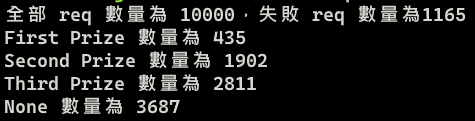
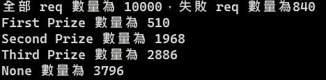
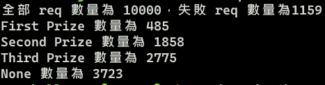
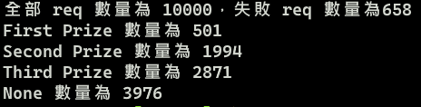

### 如何計算出每個獎品的出現機率？
根據發出固定數量的 request 數量，統計每一個收到 response 的結果，除了 FIRST、SECOND、THIRD、NONE等獎項品名，也需要考慮到回傳的結果是否合法。
```js
// 引入 request 函式庫
const request = require('request')

// 產生計算獎品機率的陣列並初始化
const prizeChanceMatrix = new Array(4)
for (let i = 0; i < prizeChanceMatrix.length; i++) {
  prizeChanceMatrix[i] = 0
}

// 設定發送 request 的數量
const testSample = 10000
// 計算過程當中的錯誤
let cntError = 0
// 用來表示剩餘發送 request 的數量
let cntSample = testSample
// 用來表示剩餘的 response 數量
let cntDisplay = testSample

// 當所有 request 都發送完才會終止
while (cntSample) {
  // 間個 1 秒鐘執行裡面的函式
  setTimeout(() => {
    request('https://dvwhnbka7d.execute-api.us-east-1.amazonaws.com/default/lottery', (error, response, body) => {
      // 若 http status code 是成功的
      if (!error && response.statusCode >= 200 && response.statusCode < 300) {
        let json = ''
        try {
          json = JSON.parse(body)
        } catch (e) {
          // 若 parse 過程當中不成功，則將此次錯誤紀錄 + 1
          // console.log('json parse error', e)
          cntError++
        }
        // 若 parse 完的結果是 undefined，則將此次錯誤紀錄 + 1
        if (json.prize === undefined) {
          cntError++
        }
        // 計算獎品出現的機率
        switch (json.prize) {
          case 'FIRST':
            prizeChanceMatrix[0]++
            break
          case 'SECOND':
            prizeChanceMatrix[1]++
            break
          case 'THIRD':
            prizeChanceMatrix[2]++
            break
          case 'NONE':
            prizeChanceMatrix[3]++
            break
          default:
            break
        }
      } else {
        // 若 status code 是不成功的，則將此次錯誤紀錄 + 1
        // console.log('錯誤 status code: ', response.statusCode)
        cntError++
      }
      // 紀錄剩餘 response 數量
      cntDisplay--
      // 若數量為 0，代表所有發出去的 req 都收到 response，則可以開始輸出結果了
      if (cntDisplay === 0) {
        console.log(`全部 req 數量為 ${testSample}，失敗 req 數量為${cntError}`)
        console.log(`First Prize 數量為 ${prizeChanceMatrix[0]}`)
        console.log(`Second Prize 數量為 ${prizeChanceMatrix[1]}`)
        console.log(`Third Prize 數量為 ${prizeChanceMatrix[2]}`)
        console.log(`None 數量為 ${prizeChanceMatrix[3]}`)
      }
    })
  }, 1000)
  // 記錄剩餘的 request 數量
  cntSample--
}

```
### 結果顯示
以下測試結果，發送 request 數量皆為 10000，並間隔 1 秒鐘重新發送  
**錯誤率代表 request 過程中出現的錯誤**  

**第一次測試結果**  
  
<pre>
Error  錯誤率: 11.65 %
FIRST  出現率:  4.35 %
SECOND 出現率: 19.02 %
THIRD  出現率: 28.11 %
NONE   出現率: 36.87 %
</pre>

**第二次測試結果**  
  
<pre>
Error  錯誤率:  8.40 %
FIRST  出現率:  5.10 %
SECOND 出現率: 19.68 %
THIRD  出現率: 28.86 %
NONE   出現率: 37.96 %
</pre>

**第三次測試結果**  
  
<pre>
Error  錯誤率: 11.59 %
FIRST  出現率:  4.85 %
SECOND 出現率: 18.58 %
THIRD  出現率: 27.75 %
NONE   出現率: 37.23 %
</pre>

**第四次測試結果**  
  
<pre>
Error  錯誤率:  6.58 %
FIRST  出現率:  5.01 %
SECOND 出現率: 19.94 %
THIRD  出現率: 28.71 %
NONE   出現率: 39.76 %
</pre>

### 總結  
<pre>
出現 FIRST  機率大約落在  4.35 % ~  5.10 %
出現 SECOND 機率大約落在 18.58 % ~ 19.94 %
出現 THIRD  機率大約落在 27.75 % ~ 28.86 %
出現 NONE   機率大約落在 36.87 % ~ 39.76 %
</pre>
**當中 Error 機率會有些許變動，機率大約落在 6.58 % ~ 11.59 %**  
